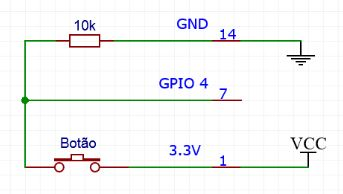

# RaspberryPi

Você já quis que sua raspberry funcionasse como uma câmera?
Para algumas aplicações seria vantajoso, certo?

Esse projeto pretende atender as seguintes necessidades:
- Ao ligar a raspberry, o código já rode em segundo plano (sem eu ter que mandar executar)
- Ao eu apertar um botão a foto seja tirada
- A foto recente não deve substituir a antiga

Vou mostrar como fazer, tudo em Python <3

Materiais utilizados:
- Rapberry pi 3
- Camera V2
- Botão sem retensão, dois pinos, normalmente fechado
- Fiozinhos / jumpers

<h2>Com a Raspberry desligada:</h2>

<h3>a) Montagem elétrica do botão</h3>
  Primeiramente vamos analisar os pinos da raspberry para entender montarmos o diagrama elétrico. Escolhi usar os pinos "1", "7" e "14", para entrada de energia, pino de leitura e pino terra, respectivamente.  

<i>Imagem extraída de https://i.stack.imgur.com/QGVhr.png </i>  

A corrente sugerida para acionar os pinos de entrada é de 3mA a 5mA. Vamos utilizar a alimentação de 3.3 V (pino 1), o pino de leitura GPIO4 (pino 7). Para representar nosso circuito, desenhei o diagrama abaixo:
 
 
<i>Circuito desenhado com essa ferramenta: https://easyeda.com/ </i>   

O botão que ganhamos é do tipo “normalmente fechado”, que quer dizer que passa energia enquanto está desativado, e quando apertarmos o botão, ele desliga. A leitura digital interpreta “tem energia” e “não tem energia”. 
  
Para garantir que quando apertar o botão o pino realmente vá para 0V, reduzindo riscos de ler flutuação de energia, usamos o resistor na configuração pull-down. 
  
Sem ele, o pino pode ler ruído e algum resquício de flutuação,de energia confundindo a leitura da raspberry, que poderá interpretar um  “0.9V” como tem energia, por ex e fazer com que o projeto não funcione.
  

<h3>b) Montagem elétrica da câmera</h3>

<i>Imagem extraida de https://www.raspberrypi.org/ </i>   

A câmera deve ser montada conforme a figura acima, a “fita”possui um lado com contatos (prateado) e outro sem (azul). O lado azul fica voltado para o conector de rede (ethernet). Após conectar a câmera finalmente podemos ligar a raspberry.    

<h2>Com a Raspberry ligada:</h2>

<h3>c) Configurando a câmera</h3>

Se for a primeira vez que você acessa a raspberry, digite os seguintes comandos (o $ aparecerá digitado, indica que não está no modo administrador):

<b>
$sudo apt-get update  
$sudo apt-get upgrade
</b>

Essa etapa demora um pouco, pois busca atualizações e pacotes para o sistema operacional e suas aplicações. Depois que finalizar as instalações, digite o comando de configurações:  

<b>
$sudo raspi-config
</b>

Agora configuraremos conforme a sequencia de prints:  
 
 
 
 

Após ativar a câmera você pode testá-la com o comando

<b>
$sudo raspistill -o image.jpg
  </b> 

<h3>d) Programa em python para a câmera</h3>

Antes de comecar o codigo, instale a biblioteca picamera da linguagem python

 <b> $sudo apt-get install python-picamera </b> 

Ou

 <b> $pip install picamera </b> 

Baixe o código liga_camera.py que se encontra nesse repositorio

<h3>e) Programa em python para monitorar botão</h3>
Salve o arquivo monitora_botao.py deste repositorio. Antes de iniciar instale a biblioteca :

 <b> $pip install RPI.GPIO </b> 

<h3>f) Rodando um programa em segundo plano</h3>
Para colocar em segundo plano no linux, editamos o arquivo rc.local por meio do seguinte comando
 
  
  
  
Antes de exit 0, insira o comando
sudo python3 /home/pi/script/monitora_botao.py &
  
Aperte control + X para sair, depois S para salvar, enter para confirmar o nome do arquivo.

